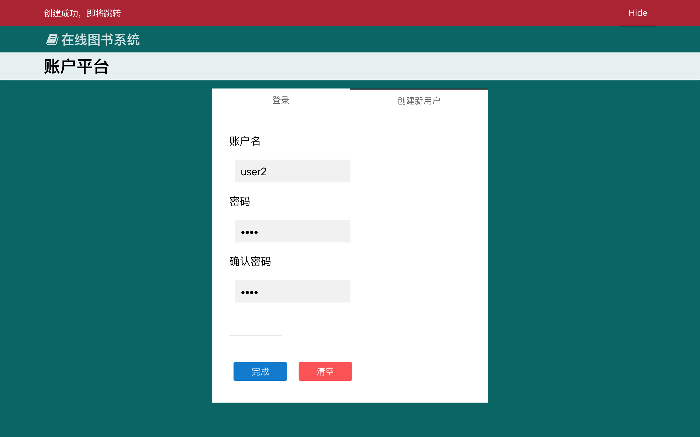

# Introduction and Demo
> NOTICE: Demo webpage is only for demonstrating, which are front-end functional ONLY.

For offical website, please visit:

https://bella.huaji.io

### Demo 1
[Click Me!](https://bella.huaji.io/manage.html)


### Demo 2
[Click Me!](https://bella.huaji.io/login.html)




### Documentation（zh-CN）

Bella FrontEnd Library 开发者文档

  


> 此框架已停止维护！

**最近的发行版：bl\_tiger\_1\_5\_1**
> 
> 作者将继续无限期提供发行版CDN、文档和源码，但发行版不再更新。
> 
> 项目（演示）官网：[https://bella.huaji.io](https://bella.huaji.io)


# bellaScript

使用 bellaScript 解释器来快速创建表单元素、表格等复杂HTML标签。

### 3.1创建一个form
```html
    <div class="bella-script">
    form{
        (select)Select多重选择:(mySelect)[opt1,opt2];
        (checkbox)CheckBox复选:(mycheck)[opt1,opt2];
        (radio)Radio单选:(myradio)[opt1,opt2];
    }
    </div>
```
### 3.2创建简单表格
```html
    <div class="bella-script">
    table
    {
        col1 | col2 | col3 | col4;
        data0 |data1 |data2 | <button>按钮</button>;
        data0 |data1 |data2 | <button>按钮</button>;
        data0 |data1 |data2 | <button>按钮</button>;
        data0 |data1 |data2 | <button>按钮</button>;
    }
    </div>
```

使用
=======

### 如何引入

在header中添加
```html
    <link href="https://bella.huaji.io/release/bella.css" rel="stylesheet">
    <link href="https://bella.huaji.io/release/default-theme.css" rel="stylesheet">
    <script src="https://bella.huaji.io/release/jquery.bella.min.js"></script>
    <script src="https://bella.huaji.io/release/bella.js"></script>
```
1\. UI
------

### 1.1 单位长度与布局系统

> bella默认提供的单位长度为40px

布局系统类似BS的栅格布局，但是远不如BS灵活（因为 bella 暂不支持响应式），我们可以用如下代码来创建一个简单的视图。
```html
     <div class="raw-w">
            <div class="raw-f">
                <div class="col-24-10 bl-view bl-page">
                    <div class="bl-view-header">hello</div>
                    <div class="bl-view-body">
                        hello bella!
                    </div>
                </div>
            </div>
    </div>
```
代码易见：bella 通过 _raw-{ WIDTH } _与 _col-{ WIDTH }-{ HEIGHT / AUTO } _来创建页面的骨架。

### 1.2 视图

bella 的页面是模块化的，任何一个基础的 可含content 的组件都是在视图的基础上继承而来。
```html
    <div class="bl-view">
        <div class="bl-view-header">标题</div>
        <div class="bl-view-body">
            视图体（允许多个）
        </div>
    </div>
```
### 1.3 标签视图

继承自视图，是一种允许多 header 的视图。
```html
    <div class="bl-tab-view">
        <div class="bl-view-header">
            <ul>
                <li class="bl-tab-view-active">Apple Inc.</li>
                <li>Google</li>
                <li>Microsoft</li>
                <li>Amazon</li>
            </ul>
        </div>
        <div class="bl-view-body"></div>
        <div class="bl-view-body"></div>
        <div class="bl-view-body"></div>
        <div class="bl-view-body"></div>
    </div>
```
### 1.4 弹出视图

继承自视图，使用`bella.showPopView("#pop-view-id")`来弹出视图。
```html
    <div class="bl-pop-view" id="demo-pop-view">
        <div class="bl-view-body">
              This is a pop view!
        </div>
    </div>
```
2.功能
----

### 2.1 AjaxAuto
```javascript
    <a href="#indexc.html">
```
在 a 链接中使用 url-HASH，bella会自动执行 url 修改与内容替换。

> 旧版本的 IE 浏览器不兼容

### 2.2 视图切换器（非Ajax实现，非iFrame）

为 list 添加switch-tag后，bella 会根据 switch-tag 的 name（也即切换器的全局唯一名称），自动搜寻下一name，然后完成函数绑定操作。
```html
    <ul class="bl-sidebar switch-tag" name="demo_switch">
        <a>Apple Inc.</a>
        <a>Google</a>
        <a>Microsoft</a>
        <a>Amazon</a>
    </ul>
    
    <ul name="demo_switch">
        <div class="bl-view-body"></div>
        <div class="bl-view-body"></div>
        <div class="bl-view-body"></div>
        <div class="bl-view-body"></div>
    </ul>
```

### 2.3 页面通知

> 在 JavaScript 中通过 bella 对象使用框架内置函数
```javascript
    bella.notify("this is notification.");
    bella.alert("this is an alert message!");
```
注意：本功能使用了时间戳来确定通知的唯一 ID，所以建议不要在其他功能中使用时间戳。

### 2.4 MarkDown支持

添加 bl-markdown 来实现自动的MarkDown转换。
```html
    <div class="bl-view bl-markdown">
```
> API 修改：旧版本的 bella 在此处使用bl-page

### 2.5 停驻式

使用attach-tag实现滚动停驻
```html
    <div class="raw-w default-subnav attach-tag">
        <div class="raw-f">
            <h2 class="col-13-a">副标题</h2>
        </div>
    </div>
```

3.使用主题
------

替换dafault-theme.css来使用其他主题
```html
    <link href="release/classic-theme.css" rel="stylesheet">
```
4.懒排版与自动排版
----------
> 不建议使用的功能，会破坏文档流

使用 .auto-compose 与 .lazy-compose 类，允许JavaScript 自动排版，请参考官网源码。

5\. 依赖库
-------

bella已经添加的依赖有：

JQuery

ShowDown.js

Highlight.js

unslider.js

ECharts.js

  

